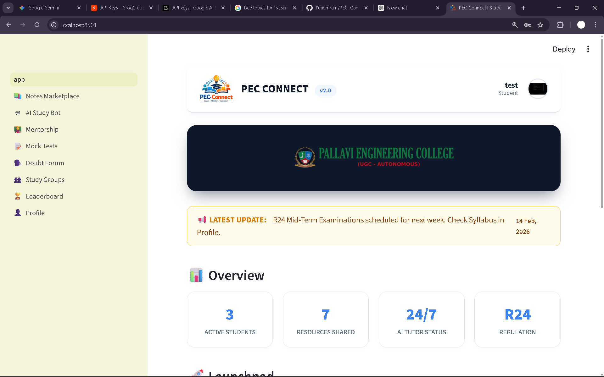

 

  

  # 🎓 PEC Connect
  ### The Ultimate Student Success Portal for Pallavi Engineering College

  
  
  
  
  

  

    <a href="#-key-features">Key Features</a> •
    <a href="#-tech-stack">Tech Stack</a> •
    <a href="#-installation--setup">Installation</a> •
    <a href="#-project-structure">Structure</a> •
    <a herf="#-screenshorts">Screenshorts</a>
  

---

## 🚀 Overview

**PEC Connect** is a centralized, AI-powered academic platform tailored for **Pallavi Engineering College**. It bridges the gap between academic struggles and success by integrating **GenAI** into the student workflow.

From an **AI "Fail-to-Pass" Tutor** that explains concepts like you're 5, to a **Mock Exam Simulator** powered by **Groq Llama 3** that mimics JNTUH R24 patterns, this platform is designed to eliminate backlogs and boost GPA.

---

## 💎 Key Features

| Module | Feature Name | Description | Tech Power |
| :--- | :--- | :--- | :--- |
| 🤖 | **AI Study Bot** | A "Fail-to-Pass" engine. Acts as a strict examiner, diagram artist, and personal tutor. Specialized in **JNTUH R24 Syllabus**. | `Gemini 2.0 Flash` |
| 📝 | **Mock Exam Simulator** | Generates instant 5-question MCQs based on previous years' patterns (R18/R22/R24). detailed solutions included. | `Groq Llama-3-70b` |
| 📚 | **Notes Marketplace** | A peer-to-peer hub for buying and selling high-quality handwritten notes. | `SQLite3` |
| 📊 | **Skill Radar** | Visualizes student strengths (Python, Math, Logic) using interactive Spider Charts. | `Plotly` |
| 🎨 | **Diagram Generator** | Instantly draws engineering flowcharts and block diagrams from text descriptions. | `Graphviz` |
| 👤 | **Glassmorphism UI** | A stunning, modern UI with "Glass" effects, Lottie animations, and a professional dashboard. | `CSS3` & `Lottie` |

---

## 🛠 Tech Stack

This project leverages the bleeding edge of Open Source AI and Python web frameworks.

* **Frontend:** [Streamlit](https://streamlit.io/) (Python-based UI)
* **LLM Orchestration:**
    * **Groq:** For ultra-fast (<1s) Mock Test generation.
    * **Google Gemini:** For deep concept explanation and grading.
* **Database:** SQLite (Lightweight, Serverless).
* **Visuals:**
    * **Plotly:** For interactive data charts.
    * **Streamlit-Lottie:** For vector animations.
    * **Graphviz:** For algorithmic diagram generation.

---

## ⚡ Installation & Setup

Follow these steps to get the app running on your local machine.

---

### 1. Clone the Repository
bash
git clone [https://github.com/00abhiram/PEC_Connect_Capstone.git](https://github.com/00abhiram/PEC_Connect_Capstone.git)
cd PEC-Connect

---

## 2. Install Dependencies Make sure you have Python installed. Then run:
Bash
pip install -r requirements.txt

---

### 3. Configure Secrets (Crucial 🔐)
This app requires API keys. Create a secret file:
1. Create a folder named .streamlit in the root directory.
2. Create a file named secrets.toml inside it.
3. Paste your keys:
TOML
# .streamlit/secrets.toml
GOOGLE_API_KEY = "your_gemini_api_key_here"
GROQ_API_KEY = "your_groq_api_key_here"

---

## 4. Run the App
Bash
streamlit run app.py

---

### 📂 Project Structure

Click to expand file tree

PEC-Connect/
├── .streamlit/
│   └── secrets.toml          # API Keys (Not pushed to GitHub)
├── pages/
│   ├── 01_📚_Notes_Marketplace.py
│   ├── 02_🤖_AI_Study_Bot.py
│   ├── 04_📝_Mock_Tests.py
│   ├── 06_👥_Study_Groups.py
│   └── 08_👤_Profile.py
├── app.py                    # Main Dashboard Entry Point
├── database.py               # SQLite Database Logic
├── requirements.txt          # Python Dependencies
├── pec_logo.png              # College Logo
└── pec_data.db               # Local Database 
(Auto-generated)

---

## Screenshorts

## Dashboard

        
        Modern Glassmorphism UI

---

## AI Study Bot

        
        
        Context-Aware R24 Tutor

---

## Mock Tests

        
        
        Groq Powered Instant Exams

---

## Profile Radar

        Performance Analytics

---

## 🤝 Contributing
Contributions are what make the open-source community such an amazing place to learn, inspire, and create. Any contributions you make are greatly appreciated.
1. Fork the Project
2. Create your Feature Branch (git checkout -b feature/AmazingFeature)
3. Commit your Changes (git commit -m 'Add some AmazingFeature')
4. Push to the Branch (git push origin feature/AmazingFeature)
5. Open a Pull Request

---

## 📜 License
Distributed under the MIT License. See LICENSE for more information.

<b>Built with ❤️ by the students of Pallavi Engineering College</b>
<a href="https://pallaviengineeringcollege.ac.in/">Visit College Website</a>

---